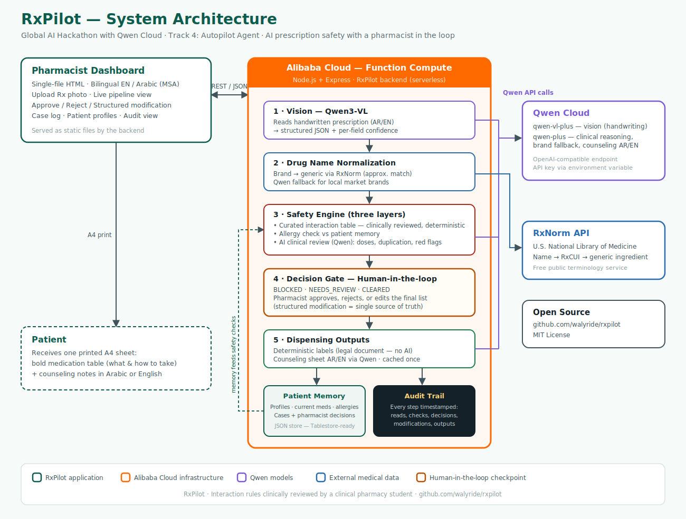

# RxPilot 💊

**An autopilot agent for pharmacies: it reads handwritten prescriptions, catches dangerous drug interactions, and never dispenses anything without a pharmacist's sign-off.**

Built for the Global AI Hackathon with Qwen Cloud — **Track 4: Autopilot Agent**.



## Why I built this

I'm a pharmacist in Egypt. Handwritten prescriptions are still everyday reality here, and I've seen how easily a dangerous combination slips through a busy counter — a patient on warfarin walks in with a new prescription for an NSAID, the handwriting is barely readable, the pharmacy is crowded, and nobody connects the dots. Medication errors like these hurt real people every day, everywhere.

Most "AI for healthcare" demos I've seen get one thing badly wrong: they either remove the pharmacist entirely (dangerous and illegal), or they just wrap a chatbot around a prompt and call it clinical software. RxPilot takes a different position: **automate the entire workflow, but make the human checkpoint impossible to skip.** Like an autopilot in a cockpit — it flies the route, but the captain is always there, and the critical moments always come back to a human.

## What it does

A pharmacist photographs a handwritten prescription (Arabic or English — doctors' handwriting welcome). RxPilot then runs the full workflow end-to-end:

1. **Reads the handwriting** with Qwen3-VL and extracts every medication into structured data — with a confidence score per reading, because "I think this says diclofenac" is not the same as "this says diclofenac".
2. **Normalizes drug names.** Brand names, misspellings, local market brands — everything is resolved to the generic ingredient through the RxNorm API, with a Qwen fallback for regional brands RxNorm doesn't know. The safety engine always compares generics, never raw strings.
3. **Runs a three-layer safety engine:**
   - A **curated table of dangerous interactions**, clinically reviewed by a pharmacist. This layer is deterministic — a contraindicated pair is caught every single time, not "usually".
   - An **allergy check** against the patient's stored profile.
   - An **AI clinical review** (Qwen) for what rule tables can't cover: doses outside usual ranges, therapeutic duplication, red flags. In testing, this layer caught a real warfarin–omeprazole interaction that wasn't in my curated table yet.
4. **Stops at the decision gate.** Every case lands in one of three states — BLOCKED, NEEDS_REVIEW, or CLEARED — and nothing is dispensed until the pharmacist acts. Approval takes one click. If the pharmacist needs to change something (say, swap diclofenac for paracetamol after calling the prescriber), the modification is **structured data, not free text**: an editable table pre-filled from the prescription. That edited list becomes the single source of truth for everything downstream.
5. **Generates dispensing outputs.** Labels are built deterministically from the approved list — a label is a legal document, so no generative model touches it. The patient counseling sheet is written by Qwen in the language the pharmacist picks for that patient (Modern Standard Arabic or English), and everything prints on a single A4 page: a bold medication table the patient can understand at a glance, with counseling notes below.
6. **Remembers.** Approved medications are written into the patient's profile, so next month's prescription is automatically checked against this month's warfarin. Every step of every case — reads, checks, decisions, edits, outputs — is timestamped in an audit trail, because in pharmacy, traceability is a legal requirement, not a nice-to-have.

## The demo scenario

Ahmed, 60, has been on warfarin (it's in his profile). A new handwritten prescription arrives: diclofenac and omeprazole.

- The curated table fires: **warfarin + diclofenac → major bleeding risk**, with the mechanism and the recommended action.
- The AI review adds a second, subtler flag: omeprazole can potentiate warfarin.
- The case stops at NEEDS_REVIEW. The pharmacist opens the modification table, removes diclofenac, adds paracetamol, confirms.
- The printed sheet shows paracetamol — not diclofenac. Ahmed's profile now says paracetamol. The audit trail records exactly who changed what and when.

That last part is the point of the whole system: **the printed label can never differ from what the pharmacist actually approved.**

## Architecture

- **Backend:** Node.js + Express, deployed on **Alibaba Cloud Function Compute** (serverless)
- **AI:** Qwen3-VL (vision) and Qwen text models via the Qwen Cloud OpenAI-compatible API
- **Drug data:** RxNorm (U.S. National Library of Medicine)
- **Frontend:** a single-file bilingual dashboard (English / Arabic, full RTL support) served as static files by the backend
- **Storage:** JSON file store behind a clean interface, designed to swap to Alibaba Cloud Tablestore without touching any other module

See the full diagram in [`docs/architecture.svg`](docs/architecture.svg).

## Design decisions I'd defend in front of any pharmacist

- **Deterministic where it must be, generative where it helps.** Interaction rules and labels are code. Handwriting reading, brand fallbacks, and counseling text are AI. Mixing those up is how people get hurt.
- **Confidence thresholds route to humans.** Any reading below 0.8 confidence, any unresolved drug name, any major interaction — the case cannot auto-clear.
- **Structured modification.** Free-text edits look convenient until a misread note prints the wrong label. The editable table costs the pharmacist three clicks and removes that entire failure class.
- **Patient-language outputs.** The counseling sheet is written for the patient, in the patient's language, at a reading level that doesn't require a medical degree.

## Quick start

```bash
git clone https://github.com/walyride/rxpilot.git
cd rxpilot
npm install
cp .env.example .env    # paste your Qwen Cloud API key
npm run test:qwen       # verify the connection
npm start               # dashboard at http://localhost:3000
```

## API overview

| Method | Endpoint | Purpose |
|---|---|---|
| POST | `/api/prescriptions/process` | Full pipeline: image → safety report + decision |
| POST | `/api/cases/:id/decision` | Pharmacist decision (APPROVED / MODIFIED / REJECTED), with structured final list |
| POST | `/api/cases/:id/outputs` | Generate labels + counseling sheet (ar/en), cached once |
| GET | `/api/cases` | Case log with status filters |
| POST / GET | `/api/patients` | Patient profiles (memory) |
| GET | `/health` | Service health |

## Privacy notes

Patient data never leaves the store (`data/` is git-ignored). Prescription images are processed in memory. The API key lives in an environment variable and is never committed.

## License

MIT